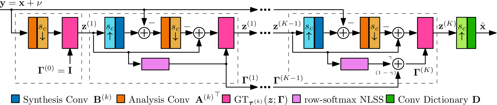
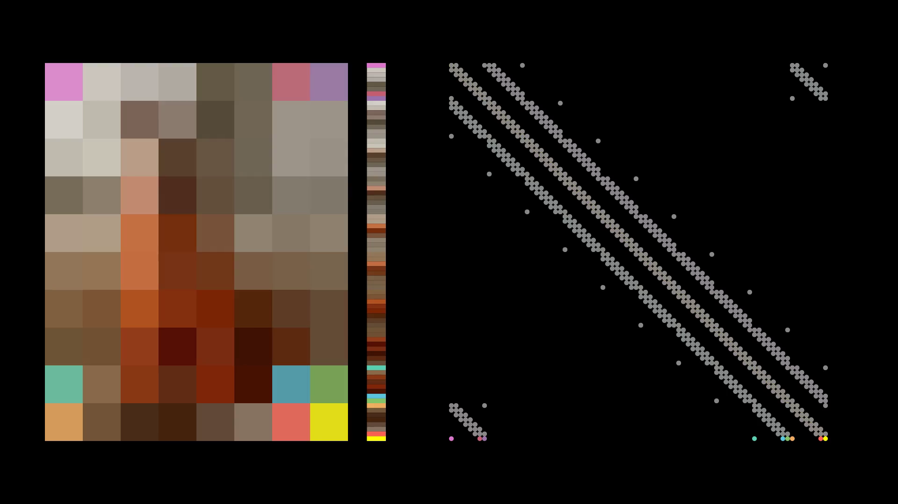

# GroupCDL-TIP
This is the official implementation of ["Fast and Interpretable Nonlocal Neural
Networks for Image Denoising via Group-Sparse Convolutional Dictionary
Learning"](https://arxiv.org/abs/2306.01950), under review for IEEE Transactions on Image Processing.


## Install
For those new to Julia, it's recommended to install via the [juliaup](https://github.com/JuliaLang/juliaup) manager:
```bash
curl -fsSL https://install.julialang.org | sh
```

Start julia (1.9) and activate the project environment:
```bash
julia +1.9 --project
```

Install requirements:
```julia
julia> import Pkg; Pkg.instantiate()
```

## Training
Copy the template config file in `scripts/config.yaml` and edit.
Train a network based on your configuration using `scripts/fit.jl`:
```julia
julia> include("scripts/fit.jl")

julia> main("path/to/config.yaml"; fit=true);
```
Training hyperparameters must be defined in the config file.

## Evaluation
Evaluate models using the config file of a trained network. Examples:
```julia
julia> include("scripts/fit.jl")

# eval a grayscale model and save denoised images
julia> main("trained_nets/GroupCDL-25/config.yaml"; eval=true, eval_dsetpath="dataset/NikoSet10", eval_awgn=25, eval_save_image=true);

# eval a color model over several noise levels
julia> main("trained_nets/CGroupCDL-0050/config.yaml"; eval=true, eval_dsetpath="dataset/Kodak", eval_awgn=5:5:50);

# eval a gray model with overlapping-window nlss inference (sliding-window is default)
julia> main("trained_nets/GroupCDL-25/config.yaml"; eval=true, eval_dsetpath="dataset/CBSD68", eval_awgn=25, eval_overlapping_window=true, eval_overlapping_window_stride=35);
```

## Extra
See `media/sliding_window.mp4` for an animation of how the block-circulant with circulant blocks sparsity pattern
of GroupCDL's adjacency matrix is a result of the sliding-window nonlocal self-similarity.


## Citation
```
@misc{janjušević2023fast,
      title={Fast and Interpretable Nonlocal Neural Networks for Image Denoising via Group-Sparse Convolutional Dictionary Learning}, 
      author={Nikola Janjušević and Amirhossein Khalilian-Gourtani and Adeen Flinker and Yao Wang},
      year={2023},
      eprint={2306.01950},
      archivePrefix={arXiv},
      primaryClass={eess.IV}
}
```
